Laboratorium Administracji Systemów Komputerowych <!-- omit in toc -->
=================================================

> Prowadzący:
> 
> - Tymoteusz Kielan tkielan@rockwellautomation.com <- tutaj wysyłamy sprawozdanie
> - Adam Ples aples@ra.rockwell.com
> - Bartosz Bątorek bbatore@ra.rockwell.com
> - Karol Janik karol.janik@rockwellautomation.com

## Spis treści <!-- omit in toc -->

- [Wprowadzenie do Windows Subsystem for Linux (WSL)](#wprowadzenie-do-windows-subsystem-for-linux-wsl)
  - [Architektura](#architektura)
  - [Sterowanie](#sterowanie)
  - [Dostęp do plików](#dostęp-do-plików)
  - [Wady i zalety](#wady-i-zalety)
- [WSL2](#wsl2)
  - [Architektura](#architektura-1)
  - [Bezpośredni dostęp to plików Windows z poziomu Linuxa](#bezpośredni-dostęp-to-plików-windows-z-poziomu-linuxa)
  - [Dostęp do plików Linuxa z poziomu Windowsa](#dostęp-do-plików-linuxa-z-poziomu-windowsa)
  - [Wady i zalety](#wady-i-zalety-1)
  - [Windows 11](#windows-11)
- [Ćwiczenia laboratoryjne](#ćwiczenia-laboratoryjne)
  - [___Zadanie 1___: Zainstaluj WSL2 na Windows 10](#zadanie-1-zainstaluj-wsl2-na-windows-10)
  - [___Zadanie 2___: Zainstaluj *Docker Desktop* dla Windows](#zadanie-2-zainstaluj-docker-desktop-dla-windows)
  - [___Zadanie 3___: Uruchomienie usługi GitLab](#zadanie-3-uruchomienie-usługi-gitlab)
  - [___Zadanie 4___: Praca z Visual Studio Code (VSC) w WSL](#zadanie-4-praca-z-visual-studio-code-vsc-w-wsl)
  - [___Zadanie 5___: Modyfikacja projektu](#zadanie-5-modyfikacja-projektu)
  - [___Zadanie 6___: Instalacja własnego pakietu w WSL](#zadanie-6-instalacja-własnego-pakietu-w-wsl)
  - [___Zadanie 7___: Code Review na Merge Request](#zadanie-7-code-review-na-merge-request)
  - [___Zadanie 8___: Integracja GitLab Workflow (opcjonalne)](#zadanie-8-integracja-gitlab-workflow-opcjonalne)

## Wprowadzenie do Windows Subsystem for Linux (WSL)

W ramach tego laboratorium zapoznamy się z WSL w wersji 2. Jest on dostępny w Windows 10 x86_64 od wersji 1903 (buildu 18362 wzwyż).

WSL daje nam możliwość uruchamiania natywnych aplikacji Linuxowych pod systemem Windows.
Do tej pory osoby, które chciały korzystać zarówno z aplikacji Windows jak i tych ze świata Linux mogły korzystać z:

- Dual boot (dwa systemy zainstalowane obok siebie, jeden albo drugi w danej chwili)
- Linux na maszynie wirtualnej (wymagana wirtualizacja i spore zasoby sprzętowe)
- Cygwin (warstwa emulacji POSIX dla Windows, przestarzała technologia z brakującą funkcjonalności i słabą wydajnością)
- Wine (emulator środowiska uruchomieniowego Windows dla Linux, nie wszystko działa)
- Porty aplikacji na inny system (na przykład MinGW)

Żadna z powyższych metod nie należy do wygodnych. W 2016 roku firma Microsoft wykonała ruch w stronę zaadresowania tych problemów tworząc projekt WSL.

WSL1 powstały w kwietniu tego roku pozwala użytkownikom zainstalować bezpośrednio z **Microsoft Store** zmodyfikowane środowisko GNU/Linux w systemie Windows 10.

### Architektura

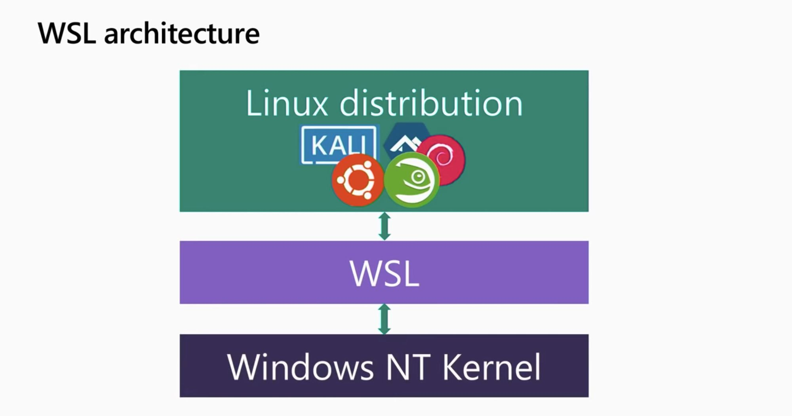

- Linux userspace - Dystrybucja Linuxa dostarczona przez partnerów, instalowana z poziomu sklepu **Microsoft Store**
- WSL - warstwa translacji będąca sterownikiem implementującym wywołania systemowe (ang. *syscalls*), system plików oraz wszystko czego dystrybucja potrzebuje do uruchomienia się.
- Windows NT Kernel - jądro systemu Windows NT, na którym zostają wywołane procesy przetłumaczone za pomocą warstwy WSL.

Dzięki zastosowaniu powyższej architektury mamy możliwość uruchamiania **niezmodyfikowanych** programów Linuxowych **ELF64** na jądrze systemu Windows.
Mówiąc prościej WSL tłumaczy syscalle Linuxowe na Windowsowe, po czym wykonuje je tak jak byśmy zlecili ich wykonanie bezpośrednio z poziomu systemu Microsoftu.

### Sterowanie

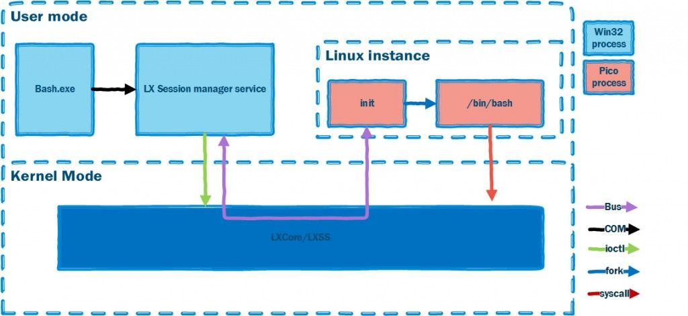

Punktem wejścia do podsystemu jest program *bash.exe* wykorzystuje on *LX Session Manager Service* oraz *LXCore/LXSS* do stworzenia instancji Linuxa. W danym momencie istnieje tylko jedna instancja Linuxa dla konkretnego użytkownika, a ponowne wywołanie wrappera *bash.exe* podpina go do aktualnie uruchomionej dystrybucji.

Po podniesieniu Linuxa, *LX Session Manager* powołuje proces *init*, który uruchamia */bin/bash*. Teraz jesteśmy w stanie korzystać z Linuxowych narzędzi i aplikacji (bez GUI) a warstwa translacji zawarta w sterowniku *LXCore/LXSS* przetłumaczy wywołania systemowe Linuxa na wywołania systemowe w Windows NT. Aby było to możliwe po stronie Linuxa powstają specjalnie wyizolowane procesy nazywane “pico processes” podłączone w trybie jądra, do dedykowanych procedur obsługi wywołań systemowych zwanych “pico providers”.

Jak można się domyśleć podejście wykorzystujące translację wywołań systemowych nie jest szalenie szybkie, szczególnie dla operacji wymagających I/O jak chociaż by *git clone* lub *npm install*. Dodatkowo istnieją **fundamentalne różnice** pomiędzy światem Windowsa a światem Linuxa dlatego niektóre translacje są bardzo wolne, a jeszcze inne wręcz niemożliwe ponieważ NT nie pozwala wykonać niektórych operacji, które można wykonać na Linuxie. Przykładem takiej operacji jest zmiana nazwy folderu, gdy znajdujący się wewnątrz plik jest otwarty przez inny proces.

### Dostęp do plików

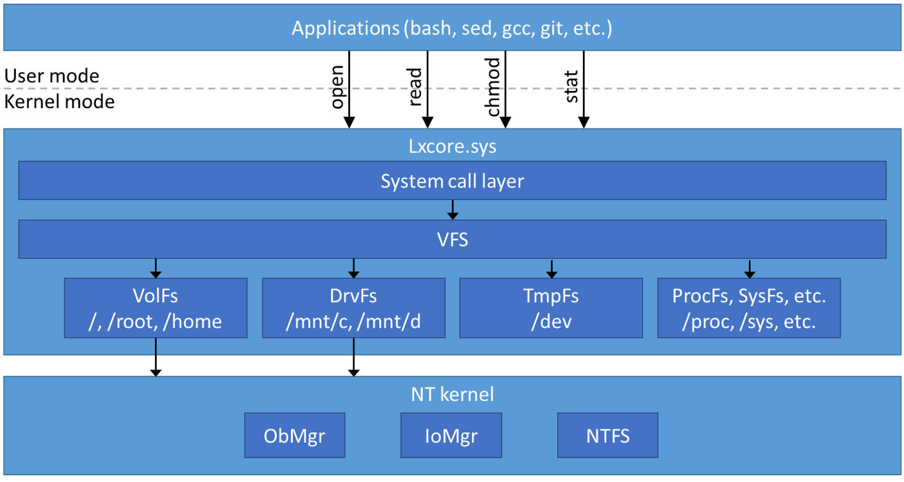

Linux wykorzystuje warstwę VFS (ang. *Virtual File System*) jako abstrakcje na różne systemy plików, takie jak Ext4, OFS itp. Warstwa ta ma za zadanie umożliwić korzystanie z niego w taki sam sposób niezależnie od tego, jaki system plików rzeczywiście leży pod spodem. Microsoft wykorzystał tę abstrakcję i wytworzył implementację dla Windows NT, która pozwala na dostęp z poziomu Linuxa do plików przechowywanych na dysku Windowsa. Pliki dostępne są w punktach montowania */mnt/c* , */mnt/d* i tak dalej.

Dzięki dostępowi do plików w systemie Microsoftu jesteśmy w stanie również uruchamiać programy zainstalowane na Windowsie z poziomu bash np. polecenie notepad.exe “nazwa pliku” otworzy podany plik w programie *notepad*. Co więcej możemy na nich używać przekierowań i pipów.

Dostęp do plików innych użytkowników:

- Linux – Każdy użytkownik komputera posiada swoje własne odizolowane pliki Linuxowe znajdujące się w katalogu *AppData\\Local\\lxss* oznacza to, że inny użytkownik komputera po uruchomieniu wrappera *bash.exe* nie ma dostępu do plików pozostałych osób.

- Windows – Jeśli z poziomu Windows nie mamy odpowiednich uprawnień na wykonanie określonej operacji to z poziomu *bash.exe* też jej nie wykonamy. Przykładowo, nie dostaniemy się do plików innego użytkownika przechowywanych w jego katalogu domowym, nawet jeśli po stronie Linuxa posiadamy uprawnienia root. Jednak gdy uruchomimy *bash.exe* jako administrator z poziomu systemu Windows, wtedy możemy tego dokonać.

### Wady i zalety

Wady:

- Wolniejsze działanie operacji I/O w porównaniu do natywnego Linuxa.
- Nie wszystkie *system-calls* są wspierane np. PTRACE_SEIZE używany przez rr (narzędzie do debugowania C/C++) nie jest wspierany.
- Nowe funkcje jądra Linuxa nie działają z automatu, WSL team musi zaimplementować dla nich translację co powoduje dodatkową pracę i opóźnienia w dostarczaniu nowych rzeczy.

Zalety:

- Dostęp do ulubionych narzędzi Linuxa z poziomu Windowsa.
- Swoboda wyboru, czy chcemy w danej chwili użyć Windowsa czy Linuxa.
- Integracja z Windowsem, możliwość dostępu do plików przechowywanych w systemie Windows.
- Uruchamianie exec Windows bezpośrednio z poziomu bash.
- Pipy działają z programami wykonywalnymi Windowsa
- IP adres wewnątrz WSL jest taki sam jak w Windows
- Łatwa instalacja
- Możliwość przełączania się pomiędzy różnymi dystrybucjami Linux
- Uruchamiasz kiedy potrzebujesz

## WSL2

Rozwiązanie wykorzystujące warstwę translacyjną wybrane w implementacji WSL1 ma kilka wad. Główne to szybkość i kompatybilność w porównaniu z natywnym Linuxem.

WSL2 postanawia zmierzyć się z problemami poprzednika, poprawić ogólną szybkość systemu oraz być w pełni kompatybilny z wywołaniami systemowymi Linuxa.

### Architektura

W drugiej wersji WSL Microsoft całkowicie zmienił architekturę systemu. Aby zapewnić wzrost wydajności i kompatybilności w stosunku do wersji pierwszej, WSL team postanowił uruchomić kompletne jądro Linuxa wewnątrz systemu Windows. Do tego celu wykorzystali ich flagową technologie wirtualizacji Hyper-V. Jądro Linuxa zostało specjalnie przystosowane i zoptymalizowane pod wykorzystanie w Windows. Jako że zarządzane jest bezpośrednio przez Microsoft oznacza to, iż wszelkie aktualizacje np. bezpieczeństwa odbywają się bezpośrednio z poziomu usługi Windows Update Service.

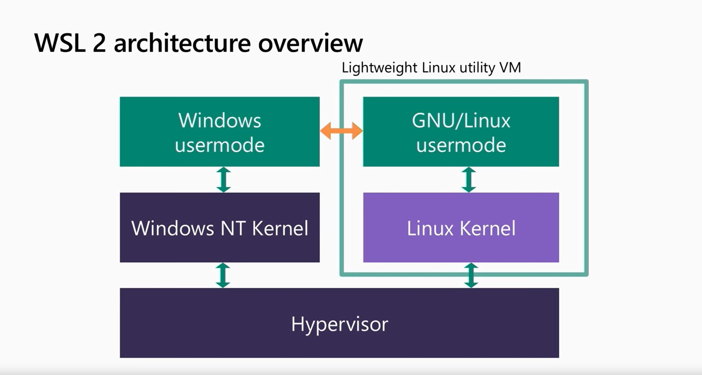

Zadajemy sobie pytanie, Linux na maszynie wirtualnej? Przecież to już było. Okazuje się, że nie jest to zwykła tradycyjna maszyna wirtualna, a specjalnie przygotowana maszyna na potrzeby WSL zintegrowana z Windowsem pozwalająca współdzielić te same zasoby bez dominacji jednego systemu nad drugim. **Lightweight utility VM** oryginalnie rozwijana była na potrzeby serwerowe i cechowała się małym narzutem wydajnościowym oraz pozwalała na uruchamianie wielu kontenerów na pojedynczym hoście. WSL2 uruchamia się niezwykle szybko (cały system “wstaje” około 1 sekundy). Maszyna podnosi się sama wtedy kiedy tego potrzebujemy i zajmuje znacznie mniej pamięci niż tradycyjna VMka.

Według dokumentacji, jądra Linuxa i Windowsa uruchomione są za pomocą zarządcy (ang. *Hypervisor*) bezpośrednio obok siebie, co wskazuje na to iż jest to zarządca typu 1, czyli Linux działa bezpośrednio na poziomie sprzętu. Rozwiązanie to ma dużo mniejszy narzut na CPU w porównaniu do zarządcy typu 2 na przykład VirtualBox, który działa na poziomie systemu operacyjnego.

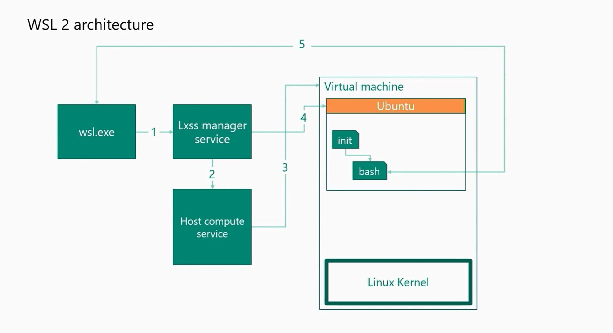

Wszystko zaczyna się od *wsl.exe*, który uruchamia podsystem, a także jest głównym punktem wejścia dla interakcji z nim. Uruchamia on również **Lxss Manager Service**, serwis ten śledzi aktualnie zainstalowane i uruchomione dystrybucje, dzięki czemu można np. zatrzymać lub listować zainstalowane Linuxy. Następnym krokiem jest wywołanie **Host Compute Service**, który uruchamia specjalnie przygotowaną Lightweight VM z jądrem Linuxa. Dane o aktualnie działającej dystrybucji mapowane są do LXSSMS i uruchamiany jest */bin/bash*. Po uruchomieniu następnie zestawione zostaje połączenie wykorzystujące socket czytający ze standardowego wejścia po stronie Windowsa i wysyłający te informacje do Linuxa. Po stronie dystrybucji Linuxa informacje te są odczytywane i traktowane jako standardowe wejście do powłoki *bash*,

W tym momencie WSL jest gotowy do pracy, cała operacja na świeżo zainstalowanym systemie bez dodatków od użytkownika trwa krócej niż sekunda.

### Bezpośredni dostęp to plików Windows z poziomu Linuxa

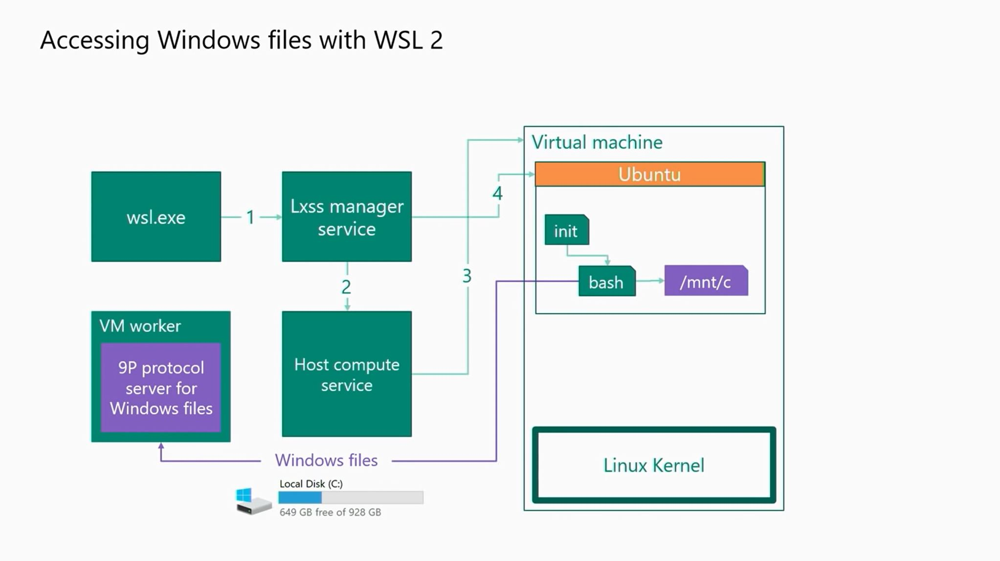

Dostęp do plików w WSL1 był bardzo prosty ponieważ leżały one fizycznie na tej samej maszynie.
Oczywiście powstało sporo kodu, który zapewniał integrację specyficznych cech systemu plików Linux w NTFS i explorerze Windows, ale nadal to była ta sama maszyna. W WSL2 mamy dwie osobne maszyny uruchomione jednocześnie obok siebie, jedna z Windowsem, druga z Linuxem. Dlatego integracja systemu plików nie jest tak prosta jak ta w WSL1.

Aby była możliwość korzystania z plików innego systemu zdecydowano się wykorzystać protokół **9P** jako łącznik pomiędzy oboma maszynami. Pozwoliło to na zamontowanie dysku Windowsa wewnątrz uruchomionej dystrybucji jako klient serwera 9P uruchomionego po stronie Windowsa. Podejście to niestety również ma wpływ na wydajność, ponieważ spada ona gdy wykorzystujemy pliki znajdujące się w drugim systemie. W tej wersji WSL tak samo jak i w poprzedniej również możemy korzystać z programów zainstalowanych w systemie Windows.

### Dostęp do plików Linuxa z poziomu Windowsa

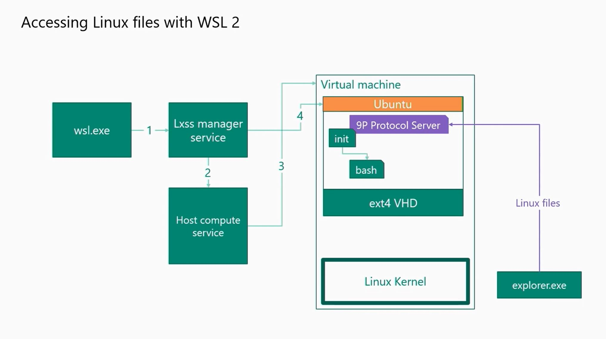

Tutaj również wykorzystany został server 9P jendak w tym przypadku uruchomiony jest on po stronie Linuxa, a jego klientem jest Windows.
Pozwala to na dostęp do plików Linuxa z poziomu Windowsa. Przykładowo możemy uruchomić

> explorer.exe .

po stronie Linuxa co spowoduje otwarcie menadżera plików w folderze, w którym aktualnie się znajdujemy.

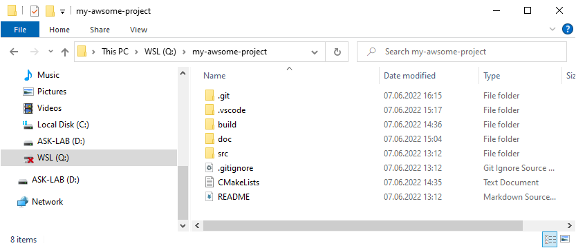

### Wady i zalety

Wady:

- Wydajność spada gdy wykorzystujemy pliki drugiego systemu (np. IDE uruchomione na Windowsie, a pliki projektu na Linuxie)

Zalety:

- Bardzo dobra wydajność w ramach jednego systemu plików
- Kompletne jądro Linuxa
- Kontenery Dockera działają bezpośrednio w WSL
- Duża integracja z systemem
- Szybkie uruchomienie, Lightweight VM wstaje koło 1 sekundy
- Aktualizowane jądro bezpośrednio z usługi Windows Update

Źródło: [Cup of Codes](https://cupofcodes.pl/)

### Windows 11

Windows 11 (od buildu 22000) zawiera ulepszoną obsługę WSL2 o możliwość uruchamiania aplikacji graficznych ze sprzętowym wspomaganiem OpenGL po zainstalowaniu odpowiednich sterowników vGPU dla WSL dostarczanych przez producentów układów graficznych takich jak Intel, AMD i NVidia.

WSL2 umożliwia naturalne używanie aplikacji GUI z Linux na systemie Windows.

- Uruchom aplikacje Linuxowe bezpośrednio z menu Start
- Przypnij aplikację Linuxową do paska zadań
- Używaj *Alt-Tab* do przełączania pomiędzy aplikacjami Linuxowymi i Windowsowymi
- Używaj wspólnego schowka (Copy & Paste) pomiędzy aplikacjami z i spoza WSL


Źródło: [Microsoft Docs](https://docs.microsoft.com/)

---

## Ćwiczenia laboratoryjne

### ___Zadanie 1___: Zainstaluj WSL2 na Windows 10

1. Zainstaluj z **Microsoft Store** następujące aplikacje:

   - *Windows Terminal Preview*,
   - *7-Zip*,
   - *Visual Studio Code* (77.8MB),
   - *Ubuntu 22.04 LTS* (646.5MB).
      Awaryjnie, zainstaluj aplikację Ubuntu z AppX z PenDrive ASK-LAB (pobrana z Microsoft Store)

      > D:\\Install\\CanonicalGroupLimited.Ubuntu22.04LTS_2204.0.9.0_neutral___79rhkp1fndgsc.AppxBundle

1. Podczas instalacji Ubuntu stwórz domyślnego użytkownika student/student
1. Zaktualizuj jądro WSL2 do najnowszego

   ```
   PS> wsl --update
   Checking for updates...
   No updates are available.
   Kernel version: 5.10.102.1
   ```

   Jest to szczególnie ważne, gdyż jądro współdzielone jest przez wszystkie zainstalowane dystrybucje WSL. Najnowsze jądro gwarantuje również najlepszą stabilność, wydajność i najmniejszą liczbę błędów.

1. Ustaw dystrybucje **Ubuntu-22.04** jako domyślną
   W tym celu otwórz zakładkę PowerShell w Windows Terminal

    ```
    PS> wsl --set-default Ubuntu-22.04
    ```
1. Zmigruj dystrybucję Ubuntu na wersję WSL2:

    ```
    PS> wsl --set-version Ubuntu-22.04 2
    Conversion in progress, this may take a few minutes...
    For information on key differences with WSL 2 please visit https://aka.ms/wsl2
    Conversion complete.
    ```

    > Potwierdź wykonanie zadania poprzez załączenie w sprawozdaniu wyniku działania polecenia:

    ```
    PS> wsl --list --verbose
    ```
1. Zamknij zakładkę PowerShell

### ___Zadanie 2___: Zainstaluj *Docker Desktop* dla Windows

1. Pobierz [instalator Docker Desktop](https://docs.docker.com/desktop/windows/install/) (494MB) lub z PenDrive ASK-LAB
1. Zainstaluj Docker Desktop Installer.exe
1. Zrestartuj PC
1. Uruchom *Docker Desktop*
1. Skonfiguruj tak by używał backendu WSL2
    
   > __Settings/General__:
   >
   > - [X] Use the WSL 2 based engine
   >
   > WSL 2 provides better performance than the legacy Hyper-V backend. Learn more.

   > __Resources/WSL integration__:
   >
   > Configure which WSL 2 distros you want to access Docker from.
   >
   > - [X] Enable integration with my default WSL distro
   >
   > Enable integration with additional distros:
   > - [X] Ubuntu-22.04

`Udokumentuj wykonanie zadania!`

   ```
   $ docker version
   ```

### ___Zadanie 3___: Uruchomienie usługi GitLab

Celem zadania jest uruchomienie usługi GitLab działającej w kontenerze WSL. W tym celu musimy najpierw sklonować kontener z GitLab za korzystając z oficjalnego obrazu [GitLab'a](https://docs.gitlab.com/ee/install/docker.html).

1. Otwórz zakładkę Ubuntu w Windows Terminal

    ```
    Welcome to Ubuntu 22.04 LTS (GNU/Linux 5.11.102.1-microsoft-standard-WSL2 x86_64)

    * Documentation:  https://help.ubuntu.com
    * Management:     https://landscape.canonical.com
    * Support:        https://ubuntu.com/advantage

    System information as of Mon Jun  6 22:02:55 CEST 2022

    System load:  1.15               Processes:             31
    Usage of /:   1.9% of 251.98GB   Users logged in:       0
    Memory usage: 55%                IPv4 address for eth0: 172.27.189.246
    Swap usage:   0%


    0 updates can be applied immediately.
    $
    ```
1. Zainstaluj niezbędne do dalszej części laboratorium narzędzia

    ```
    $ sudo apt update
    ```
    ```
    $ sudo apt install g++ cmake ninja-build
    ```

1. Pobierz kontener z GitLab (ponad 1GB)

    ```
    $ docker run --detach \
        --env GITLAB_HOME=/srv/gitlab \
        --hostname localhost \
        --publish 80:80 --publish 443:443 --publish 22:22 \
        --name gitlab \
        --restart always \
        --shm-size 256m \
        gitlab/gitlab-ee:latest
    ```

    Alternatywnie wypakujmy obraz przy użyciu *7-Zip* z pliku *D:\\Docker\\gitlab-ee.tar.7z* na PenDrive ASK-LAB do *C:\\Temp*

    Następnie zaimportujmy wypakowany obraz do Dockera:

    ```
    $ docker load -i /mnt/c/Temp/gitlab-ee.tar
    ```

1. Skonfiguruj usługę GitLab

   W aplikacji *Docker Desktop* wybierz zakładkę *Containers*:

   - W kontenerze *gitlab/gitlab-ee:latest*: Open with browser...
   - Poczekaj aż wystartuje usługa GitLab
   
     [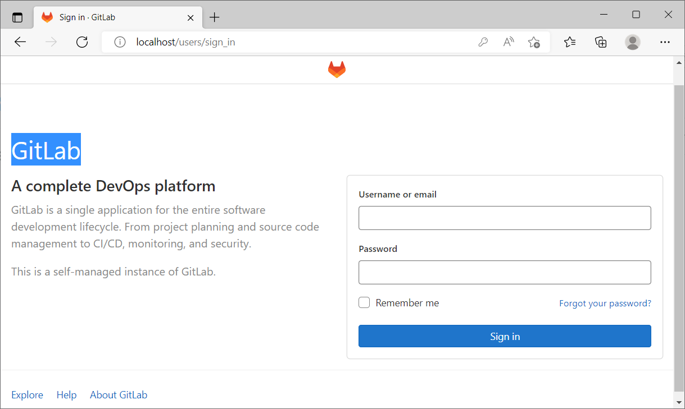](http://localhost)

   - Otwórz terminal z kontenera: Open in terminal...

     ```
     # bash
     root@localhost:/# grep Password: /etc/gitlab/initial_root_password
     Password: your_very_long_secret_root_password_here
     ```
   - Skopiuj hasło do schowka
   - Zaloguj się do GitLab na użytkownika *root* przy użyciu tego hasła (zapamiętaj je w przeglądarce, może przydać się później)
   - Zamknij terminal z wnętrza kontenera *gitlab*
   - W panelu administracyjnym [GitLab Admin](http://localhost/admin/users) stwórz 3 użytkowników:
     - ASK Lab Student/student/student123/student@polsl.pl/Regular
     - ASK Lab Assistant/assistant/assistant123/assistant@polsl.pl/Regular
     - ASK Lab Docent/docent/docent123/docent@polsl.pl/Administrator (opcjonalnie)

     > ___Uwaga:___ Najpierw tworzymy użytkownika bez hasła, następnie edytujemy go ustawiając wstępne hasło (powyżej), a na koniec przy pierwszym logowaniu użytkownik musi ustawić nowe hasło!
   - Zaloguj sie na nowo stworzonego użytkownika *student* i ustaw nowe hasło: *asklabstudent*
   - Zapamiętaj hasło w przeglądarce (może być często używane).
   - Stwórz nowy projekt: my-awsome-project poprzez [Import](http://localhost/projects/new#import_project).
   - Jako **Git repository URL** wpisz link podany przez prowadzącego.
   - Ustaw *Visibility Level: Internal*
   - Dodaj do projektu użytkowników *assistant* i *docent* (opcjonalnie)
     w [Project information/Members](http://localhost/student/my-awsome-project/-/project_members)

1. Wygeneruj parę kluczy SSH bez hasła

    ```
    $ ssh-keygen -t ed25519
    Generating public/private ed25519 key pair.
    Enter file in which to save the key (/home/student/.ssh/id_ed25519):
    Created directory '/home/student/.ssh'.
    Enter passphrase (empty for no passphrase):
    Enter same passphrase again:
    Your identification has been saved in /home/student/.ssh/id_ed25519
    Your public key has been saved in /home/student/.ssh/id_ed25519.pub
    The key fingerprint is:
    SHA256:536AVkrt2h93HzJNtbe47unaieudKkl8UXa2CjH01sk student@localhost
    The key's randomart image is:
    +--[ED25519 256]--+
    |          ..     |
    |           o.ooo.|
    |         .  =ooEo|
    |        . oo.  .o|
    |       .S=. o .o.|
    |        +=o. .+ o|
    |       ..o+..+.+.|
    |        .+. =oB.o|
    |          +OO@  .|
    +----[SHA256]-----+

    $ cat ~/.ssh/id_ed25519.pub
    ssh-ed25519 ...
    ```

    Skopiuj do schowka linijkę z kluczem (przyda się w dalszej części). 

1. Wgraj klucz publiczny na server *GitLab* dla użytkownika *student*

    - W prawym górnym rogu na avatarze przejdz do: [Edit profile/SSH keys](http://localhost/-/profile/keys)
    - Wklej zawartość schowka do pola *Key* i dodaj klucz: *Add key*
    - Dodany klucz SSH do profilu w GitLab powinien wygladać podobnie do:

      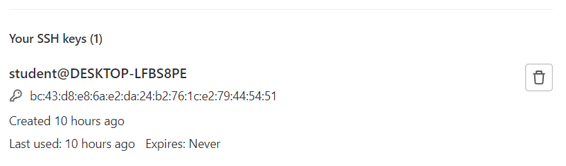

    Zapisz wrzut ekranu z [zaimportowanego projektu](http://localhost/student/my-awsome-project).

    > W sprawozdaniu powinien znaleźć się klucz publiczny wygenerowany na potrzeby komunikacji z serwerem GitLab oraz zrzut ekranu z projektu my-awsome-project.

### ___Zadanie 4___: Praca z Visual Studio Code (VSC) w WSL

1. Uruchom Visual Studio Code (menu Start) lub poleceniem *code* z Windows Terminal PowerShell.

1. Zainstaluj nowe rozszerzenie dla VSC (*Ctrl-Shift-X*)

   > Remote - WSL

   > Poświęć chwilę, żeby zapoznać się z dokumentacją na stronie tego rozszerzenia.

1. Przeładuj *Visual Studio Code*, tak aby uruchomiło się wewnątrz WSL.

    - Uruchom paletę komend *Ctrl-Shift-P* i wpisz:

      > Remote-Wsl: New WSL Window

      Stworzy się nowa instancja VSC, a starą możemy zamknąć.
    - Zweryfikujmy uruchamiając nowy Terminal w VSC (*Ctrl-Shift-`*) i wpisując polecenie *git*.

      Standardowo w Windows nie ma zainstalowanego programu Git, a w domyślnym obrazie WSL Ubuntu jest.
      Będzie on niezbędny do wykonania dalszej części laboratorium.

1. Również przy użyciu Terminala konfigurujemy git'a

   ```
   student@DESKTOP-LFBS8PE:~/my-awsome-project$ git config --global user.email "student@polsl.pl"
   student@DESKTOP-LFBS8PE:~/my-awsome-project$ git config --global user.name "ASK Lab Student"
   ```
   Pozwoli nam to na dokonywanie zmian w kodzie posługując się tożsamością użytkownika *student*.

1. Wewnątrz WSL zainstalujmy pozostałe niezbędne rozszerzenia:

   - C/C++
   - CMake Tools

1. Sklonujmy nasz projekt *my-awsome-project* z GitLab do wnętrza WSL

    > Git: Clone

    > git@localhost:student/my-awsome-project.git

1. Visual Studio Code powinno zauważyć obecność pliku *CMakeLists.txt* w głównym katalogu repozytorium i zapytać, czy skonfigurować projekt.
   W takim przypadku, potwierdzamy (w prawym dolnym rogu, w wyskakującym oknie).

   Na tym etapie nasz projekt powinien się już budować i uruchamiać.

1. Testujemy budowanie oraz uruchamianie projektu (przycisk Play na pasku statusowym)

   

> Do sprawozdania proszę dodać wynik działania aplikacji *Whale*.

### ___Zadanie 5___: Modyfikacja projektu

Zadanie to polega na wprowadzeniu dowolnych widocznych zmian w projekcie, przebudowanie go, przetestowanie go i wypchniecie zmian na prywatną gałąź na naszym lokalnym serwerze GitLab.

Ostatnią część przykładowo można wykonać z terminala poprzez:

```
$ git checkout -b student/my_feature_branch
$ git add -u
$ git commit -m "Moje przykladowe zmiany w projekcie..."
$ git push origin HEAD
```

> Do sprawozdania dodajemy historie naszej wypchniętej gałęzi.

Przykład brancha [student/my_feature_branch](http://localhost/student/my-awsome-project/-/commits/student/my_feature_branch)

### ___Zadanie 6___: Instalacja własnego pakietu w WSL

W dalszej części wygenerujemy pakiet instalacyjny DEB i zainstalujemy go w WSL.

W terminalu wydajemy polecenie:

```
student@DESKTOP-LFBS8PE:~/my-awsome-project$ cmake --build build --target package
[0/1] Run CPack packaging tool...
CPack: Create package using DEB
CPack: Install projects
CPack: - Install project: Whale []
CPack: Create package
CPack: - package: /home/student/my-awsome-project/build/Whale-0.0.1-Linux.deb generated.
```

Następnie instalujemy pakiet:

```
student@DESKTOP-LFBS8PE:~/my-awsome-project$ sudo apt install ./build/Whale-0.0.1-Linux.deb
```

> W sprawozdaniu zawieramy dowód na to że program Whale zainstalowany jest na ścieżce systemowej.

Następnie tworzymy pakiet źródłowy:

```
student@DESKTOP-LFBS8PE:~/my-awsome-project$ cmake --build build --target package_source
[0/1] Run CPack packaging tool for source...
CPack: Create package using TXZ
CPack: Install projects
CPack: - Install directory: /home/student/my-awsome-project
CPack: Create package
CPack: - package: /home/student/my-awsome-project/build/Whale-0.0.1-Source.tar.xz generated.
```

Wrzucamy plik binarny do katalogu [___release___](http://localhost/student/my-awsome-project/-/tree/main/release) z poziomu interfejsu webowego.

> Jako dowód wykonania zadania dołączamy zrzut ekranu z powyższego linku.

### ___Zadanie 7___: Code Review na Merge Request

Po wykonaniu __Zadania 5__ domyślnie zainstalowane hooki w GitLab powinny wyświetlić nam link do stworzenia nowego MR.

```
...
remote:
remote: To create a merge request for tkielan/doc_update, visit:
remote:   http://localhost/student/my-awsome-project/-/merge_requests/new?merge_request%5Bsource_branch%5D=tkielan%2Fdoc_update
remote:
To localhost:student/my-awsome-project.git
```

Możemy skorzystać z tego linka, który otworzy nam przeglądarkę z naszym GitLabem lub skorzystać z innej metody na stworzenie Merge Request.

Jeśli otworzymy nasze repozytorium w [GitLab](http://localhost/student/my-awsome-project), tuż po wypchnięciu nowych zmian na zdalną gałąź, powinniśmy zauważyć podobną informację.

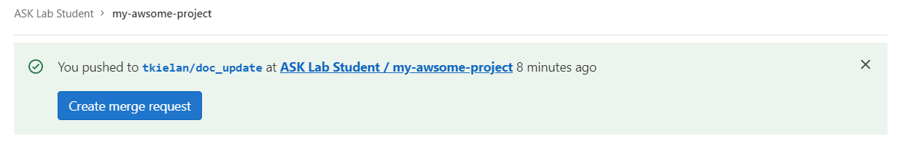

Klikając w przycisk "Create merge request" osiągniemy podobny rezultat do otwarcia linka z terminala.

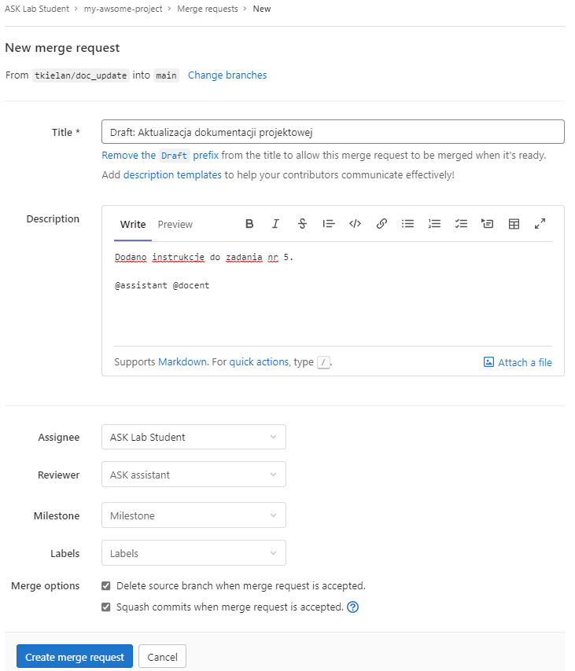

> ___Uwaga:___ Zawsze tworzymy nowe MRy w stanie *Draft*!

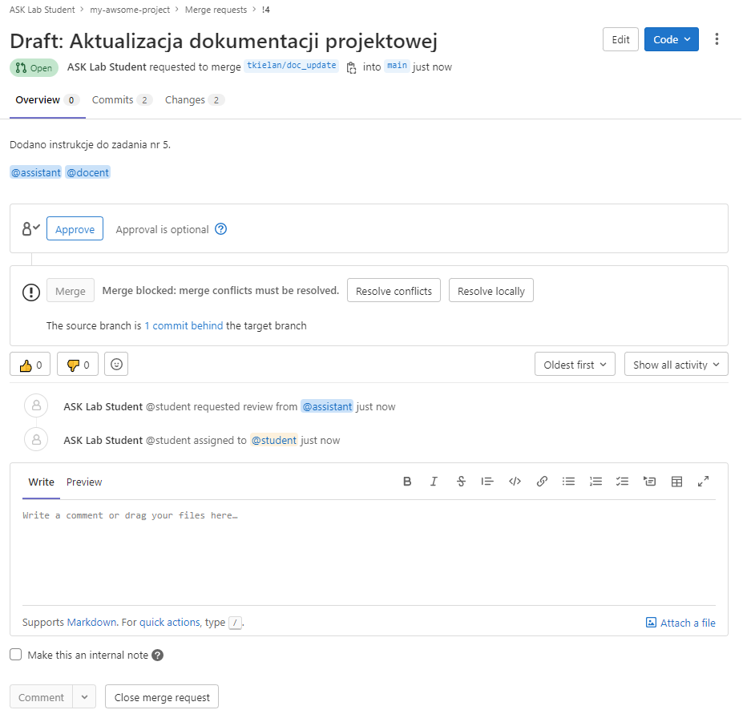

Żeby MR był gotowy do review, uzupełniamy wszystkie wymagane pola i dodajemy odpowiednie osoby do Code Review na MR.
Ustawiamy osobę *assistant* jako Reviewer i prosimy kolegę/koleżankę z sekcji, żeby zalogował się na to konto w GitLab i przeprowadził Code Review.

W tym celu sprawdzamy nasz adres IP w Windows Terminal:

```
PS> ipconfig
```

i zapamiętujemy w schowku.

Na końcu usuwamy stan *Draft*. To daje sygnał osobom odpowiedzialnym za review, że to właśnie odpowiedni moment, żeby się zaangażować.

Podajemy koledze/koleżance z sekcji link w formie:

http://nasz_adres_ip

Nasz kolega/koleżanka będzie udawać asystenta logując się do GitLab jako *assistant*.

W ćwiczeniu chodzi o dodanie paru komentarzy dotyczących treści samych zmian, które *student* próbuje dokonać w projekcie.

> Rolą reviewera jest bycie krytycznym w stosunku do tych zmian.

Każdy komentarz umieszczony pod zmianą powinien zostać zaadresowany i rozwiązany zanim MR zostanie zatwierdzony i zmergowany z główną gałęzią *main*.

> W sprawozdaniu proszę zawrzeć historię zmian takiego MR'a obrazującą przeprowadzone review kodu.

> Taka historia często wykorzystywana jest podczas audytu projektu (nawet przez firmy zewnętrzne, takie jak na przykład TÜV), w celu weryfikacji zgodności ze wdrożonym procesem wytwarzania oprogramowania.

### ___Zadanie 8___: Integracja GitLab Workflow (opcjonalne)

Stwórzmy [nowy token](http://localhost/-/profile/personal_access_tokens) o nazwie *vscode*.

Wybierzmy *api* spośród dostępnych opcji.

> **Select scopes**
> 
> Scopes set the permission levels granted to the token.
> 
> - [X] api
> 
> Grants complete read/write access to the API, including all groups and projects, the container registry, and the package registry.

Następnie generujemy sam token.

> Your new personal access token
>
> *Hzvwt48DpUCHa2p2oKGM*
>
> Make sure you save it - you won't be able to access it again.

Teraz skopiujmy token do schowka w celu użycia w VSC.

W jednym z poprzednich zadań instalowaliśmy dodatki do VSC. Zainstalujmy jeszcze jeden dodatek do VSC:

> GitLab Workflow

Wykorzystajmy trochę czasu na przejrzenie multimedialnej dokumentacji na stonie poświęconej tej wtyczce.

Teraz skonfigurujemy wtyczkę do współpracy z naszym GitLabem.

> GitLab: Add Account to VS Code

> http://localhost
>
> URL to Gitlab instance

> Hzvwt48DpUCHa2p2oKGM
>
> Paste your GitLab Personal Access Token...

W tym momencie powinnismy mieć Visual Studio Code sprzęgnięte z naszym osobistym serwerem GitLab!

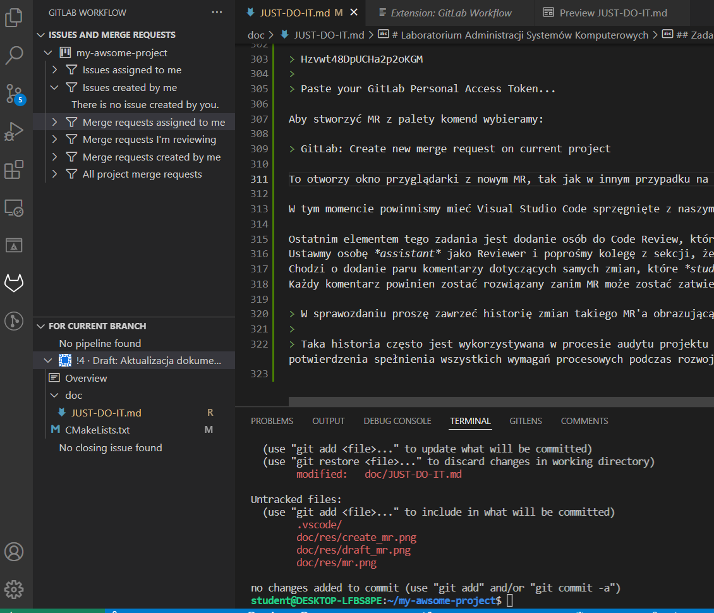

Aby stworzyć MR z palety komend wybieramy:

> GitLab: Create new merge request on current project

To otworzy okno przyglądarki z nowym MR, podobnie w poprzednim zadaniu.

> Wykonanie zadania kończy się dodaniem do sprawozdania dowodu na poprawną integrację VSC z serwerem GitLab.
